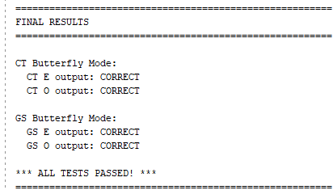
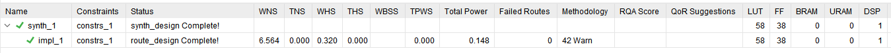

# High-Performance Modular Multiplier for PQC (Kyber & Falcon) on FPGA

## Overview

This repository provides an ultra-low-area hardware implementation of modular reduction and multiplication for Post-Quantum Cryptography (PQC) schemes.

Based on the novel **K-LUT reduction** technique proposed by *Bertels et al. (2024)* in "A Better Kyber Butterfly for FPGAs", this project achieves the smallest reported area for the Kyber modular multiplier. Furthermore, we bridge the gap between academic theory and engineering by:

1.  **Completing the Architecture**: Extending the original butterfly-only design into a full modular multiplier Processing Element (PE), integrated into the architecture of *Yaman et al.*.
2.  **Algorithm Portability**: Successfully porting the K-LUT reduction technique to the **Falcon** signature scheme, demonstrating the method's versatility.

## Key Features

- **Minimal Area (Kyber)**: Achieves **49 LUTs** and **1 DSP** for the modular multiplier, utilizing the hybrid K-reduction and LUT-based reduction strategy.
- **High Performance (Falcon)**: Optimized K-LUT reduction for Falcon achieves **291 MHz** on Artix-7.
- **Robust Verification**: Includes comprehensive testbenches covering all possible twiddle factors and input ranges to ensure 100% computational accuracy.



## Performance & Resource Utilization

The designs were implemented and synthesized using **Vivado 2024.2** on a Xilinx **Artix-7 FPGA** (`xc7a200tffg1156-3`).

| Algorithm           | Frequency ($F_{max}$) | LUTs   | FFs    | DSPs  | Modulus ($q$) | Structure ($k \cdot 2^x + 1$) |
| :------------------ | :-------------------- | :----- | :----- | :---- | :------------ | :---------------------------- |
| **Kyber (ML-KEM)**  | **331 MHz**           | **49** | **32** | **1** | 3329          | $13 \cdot 2^8 + 1$            |
| **Falcon (FN-DSA)** | **291 MHz**           | **58** | **38** | **1** | 12289         | $3 \cdot 2^{12} + 1$          |



## Project Structure

```text
├── src/
│   ├── multiplier_kyber/    # Full Modular Multiplier for Kyber (based on Yaman's PE)
│   └── reduction_falcon/    # K-LUT Reduction Unit adapted for Falcon
├── tb/						 # testbench
├── test-data/
└── README.md
```

## Technical Details

### The K-LUT Reduction Technique

Modular reduction is often the bottleneck in Lattice-based cryptography. This project leverages the specific structure of PQC moduli ($q = k \cdot 2^x + 1$) to perform efficient reduction:

1. **LUT-based Reduction**: Uses FPGA primitives (LUT-6) to pre-calculate reduction for high-order bits.
2. **K-Reduction**: Exploits the property $k \cdot 2^x \equiv -1 \pmod q$ to strictly bound the result.

### Adaptation for Falcon

We extended the technique to the Falcon algorithm by adapting the parameters to its specific modulus:

- **Modulus**: $q = 12289$
- **Decomposition**: $12289 = 3 \cdot 2^{12} + 1$
- **Optimization**: The design efficiently handles the larger bit-width required for Falcon while maintaining a high clock frequency (291 MHz).

## Requirements

- **FPGA**: Xilinx Artix-7 (tested on `xc7a200tffg1156-3`)
- **Toolchain**: Xilinx Vivado 2024.2
- **Language**: Verilog HDL

## References

If you use this code in your research, please acknowledge the following foundational works:

1. **Bertels, J., et al.** "[A Better Kyber Butterfly for FPGAs](https://ieeexplore.ieee.org/document/10705545/)" (FPL 2024).
2. **Yaman, F., et al.** "[A Hardware Accelerator for Polynomial Multiplication Operation of CRYSTALS-KYBER PQC Scheme](https://ieeexplore.ieee.org/document/9474139/)" (DATE 2021).