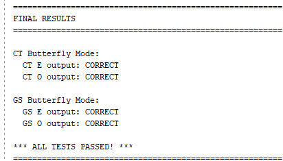
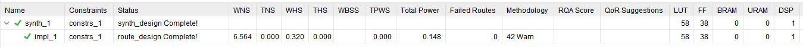

# High-Performance Modular Multiplier for PQC (Kyber & Falcon) on FPGA

## Overview

This repository provides an ultra-low-area hardware implementation of modular reduction and multiplication for Post-Quantum Cryptography (PQC) schemes.

Based on the novel **LUT-K reduction** technique proposed by *Bertels et al. (2024)* in "A Better Kyber Butterfly for FPGAs", this project achieves the smallest reported area for the Kyber modular multiplier. Furthermore, we bridge the gap between academic theory and engineering by:

1.  **Completing the Architecture**: Extending the original butterfly-only design into a full modular multiplier Processing Element (PE), integrated into the architecture of *Yaman et al.*.
2.  **Algorithm Portability**: Successfully porting the LUT-K reduction technique to the **Falcon** signature scheme, demonstrating the method's versatility.

## Key Features

- **Minimal Area (Kyber)**: Achieves **49 LUTs** and **1 DSP** for the modular multiplier, utilizing the hybrid K-reduction and LUT-based reduction strategy.
- **High Performance (Falcon)**: Optimized LUT-K reduction for Falcon achieves **291 MHz** on Artix-7.
- **Robust Verification**: Includes comprehensive testbenches covering all possible twiddle factors and input ranges to ensure 100% computational accuracy.

<p align="center">
   
</p>
<p align="center"><em>Figure 1. Implemented and synthesized results on Artix-7 in Vivado 2024.2.</em></p>

## Performance & Resource Utilization

The designs were implemented and synthesized using **Vivado 2024.2** on a Xilinx **Artix-7 FPGA** (`xc7a200tffg1156-3`).

| Algorithm           | Frequency ($F_{max}$) | LUTs   | FFs    | DSPs  | Modulus ($q$) | Structure ($k \cdot 2^x + 1$) |
| :------------------ | :-------------------- | :----- | :----- | :---- | :------------ | :---------------------------- |
| **Kyber (ML-KEM)**  | **331 MHz**           | **49** | **32** | **1** | 3329          | $13 \cdot 2^8 + 1$            |
| **Falcon (FN-DSA)** | **291 MHz**           | **58** | **38** | **1** | 12289         | $3 \cdot 2^{12} + 1$          |

<p align="center">
   
</p>
<p align="center"><em>Figure 2. Simulation results of the LUT-K reduction architecture for Falcon.</em></p>

### Polynomial Multiplier Comparison

The following table compares the full polynomial multiplier (NTT → PWM → INTT) with prior work. Area is calculated as $\text{LUT} + 100 \cdot \text{DSP} + 300 \cdot \text{BRAM}$.

| Work      | Platform | PEs  | LUT  | DSP  | BRAM | $F_{max}$ (MHz) | Latency (cycles) NTT/INTT/PWM | Total Time (µs) | Area | ATP       |
| :-------- | :------- | :--- | :--- | :--- | :--- | :-------------- | :---------------------------- | :-------------- | :--- | :-------- |
| Yaman     | Artix-7  | 1    | 948  | 1    | 2.5  | 190             | 904/904/647                   | 17.68           | 1798 | 31,788.64 |
| Yaman     | Artix-7  | 4    | 2543 | 4    | 9    | 182             | 232/233/167                   | 4.75            | 5643 | 26,804.25 |
| Our Works | Artix-7  | 1    | 742  | 1    | 2.5  | 224             | 906/906/649                   | 15.03           | 1592 | 23,927.76 |
| Our Works | Artix-7  | 4    | 1559 | 4    | 9    | 204             | 234/235/169                   | 4.27            | 4659 | 19893.93  |


## Project Structure

```text
├── src/
│   ├── high-performance-multiplier/    # High-performance Kyber multiplier (4-PE)
│   ├── lightweight-multiplier/         # Lightweight Kyber multiplier (1-PE)
│   └── reduction-falcon/               # LUT-K reduction unit for Falcon
├── tb/                                 # Vivado simulation testbenches
├── test-data/                          # Reference vectors for verification
│   ├── pe1/                            # 1-PE test vectors (Kyber)
│   └── pe4/                            # 4-PE test vectors (Kyber)
├── sim/                                # Verilator simulation & security test
│   ├── LUT6.v                          # Behavioral model for Xilinx LUT6 primitive
│   ├── SRLC32E.v                       # Behavioral model for Xilinx SRLC32E primitive
│   ├── hpmm_security_test.cpp          # C++ testbench for Verilator
│   └── Makefile                        # Verilator build & run flow
├── assets/                             # Diagrams and figures
└── README.md
```

## Functional Description

This project provides two independent hardware IP cores and one reduction primitive:

### 1. Kyber Modular Multiplier (High-Performance — 4-PE)

`src/high-performance-multiplier/` implements a **4 Processing Element** polynomial multiplier for the Kyber (ML-KEM) scheme. Each PE handles one 12-bit coefficient pair per cycle, giving a throughput of 4 coefficients/cycle. It supports three hardware-controlled operations triggered by a single-cycle strobe signal:

| Operation | Signal | Description |
|:----------|:-------|:------------|
| Forward NTT | `start_fntt` | Transforms coefficients into the NTT domain |
| Pointwise Mul | `start_pwm2` | Coefficient-wise multiplication in NTT domain |
| Inverse NTT | `start_intt` | Transforms back and outputs final product |

A full polynomial multiplication (256-point NTT × NTT → PWM → INTT) completes automatically; the `done` signal pulses for one cycle upon completion.

### 2. Kyber Modular Multiplier (Lightweight — 1-PE)

`src/lightweight-multiplier/` is the area-minimal variant using a **single PE**. It exposes the same interface as the 4-PE version (drop-in compatible signals), but processes one coefficient pair per cycle at lower throughput. This is the design that achieves **49 LUTs + 1 DSP** at 331 MHz.

### 3. Falcon LUT-K Reduction Unit

`src/reduction-falcon/` provides:
- **`falcon_KRED`**: A 2-stage pipelined modular multiplier for $q = 12289$ using the LUT-K technique. Computes $(-3 \cdot a \cdot b) \bmod q$; the implicit $-3$ factor is absorbed into pre-computed twiddle factors ($W' = W \cdot (-3)^{-1} \bmod q$, where $(-3)^{-1} \bmod 12289 = 4096$).
- **`butterfly_falcon_kred`**: A complete CT/GS butterfly unit integrating `falcon_KRED` for full NTT on 1024-coefficient Falcon polynomials.

---

## Installation

### Prerequisites

| Tool | Version | Notes |
|:-----|:--------|:------|
| Xilinx Vivado | 2024.2 (recommended) | Synthesis, implementation & simulation |
| Target FPGA | Artix-7 `xc7a200tffg1156-3` | Or compatible Artix-7 device |

> Vivado can be downloaded from [AMD/Xilinx Download Center](https://www.xilinx.com/support/download.html). A free WebPACK license is sufficient for Artix-7 synthesis.

### Clone the Repository

```bash
git clone https://github.com/Kyrie-T/HPMM.git
cd HPMM
```

### Add Sources to Vivado

1. Launch Vivado and create a new **RTL Project**.
2. In the *Add Sources* dialog, add all `.v` files from the desired `src/` sub-directory.
3. Set the top-level module:
   - For 4-PE Kyber: `KyberHPM4PE_top`
   - For 1-PE Kyber: `KyberHPM1PE_top`
   - For Falcon reduction only: `falcon_KRED` or `butterfly_falcon_kred`
4. Set the target part to `xc7a200tffg1156-3` (or your device).

---

## Usage

### Running Testbenches (Simulation)

All testbenches in `tb/` are self-checking and print `PASS` / `FAIL` to the console. Reference data is loaded from `test-data/` via `$readmemh`.

**In Vivado Simulator:**

1. Add the chosen testbench `.v` from `tb/` as a simulation source.
2. Add the corresponding `src/` RTL files.
3. Set the **Simulation Top** to the selected testbench module:
   - `tb/KyberHPM4PE_test_ALL_FULL.v` -> `KyberHPM4PE_test_ALL_FULL`
   - `tb/KyberHPM1PE_test_ALL_FULL.v` -> `KyberHPM1PE_test_ALL_FULL`
   - `tb/KyberHPM1PE_test_FNTT.v` -> `KyberHPM1PE_test_FNTT`
   - `tb/KyberHPM1PE_test_INTT.v` -> `KyberHPM1PE_test_INTT`
   - `tb/falcon_KRED_tb.v` -> `falcon_KRED_tb`
   - `tb/butterfly_falcon_kred_tb_simple.v` -> `butterfly_falcon_kred_tb_simple`
4. Run behavioral simulation (`Run Simulation → Run Behavioral Simulation`).
5. Observe the console output for test results.

### Verilator-Based Security Verification

As an independent verification path, the design has been tested with **Verilator** (the open-source Verilog simulator) to rule out the presence of intentionally inserted malicious code (hardware Trojans / backdoors). The Verilator flow compiles the RTL into a C++ cycle-accurate model and drives it with a custom C++ testbench that validates all operations against known-good reference vectors loaded from `test-data/`.

#### Motivation

Hardware backdoors can be inserted through hidden state machines, undocumented opcodes, conditional trigger logic, or side-channel data paths. A second-tool verification using a completely independent simulation engine (Verilator vs. Vivado XSIM) and a separately written testbench helps detect discrepancies that would be invisible to a single-tool flow.

#### What the Flow Does

1. **Behavioral Models for Xilinx Primitives**: The design uses Xilinx-specific primitives (`LUT6`, `SRLC32E`). Behavioral Verilog models are provided in `sim/LUT6.v` and `sim/SRLC32E.v` so Verilator can compile the design without vendor libraries.
2. **C++ Testbench** (`sim/hpmm_security_test.cpp`): Drives the `KyberHPM1PE_top` module through three independent operations, each compared against the same reference vectors used by the Vivado testbenches:
   - **FNTT**: Forward NTT on a 256-coefficient polynomial; output compared against `KYBER_DIN0_MFNTT.txt`.
   - **INTT**: Inverse NTT on FNTT-domain data; output compared against the original polynomial (`KYBER_DIN0.txt`).
   - **Full Polynomial Multiplication** (FNTT A + FNTT B + POS + INTT): Complete Kyber polynomial multiplication; output compared against `KYBER_DOUT.txt`.

#### Running the Verilator Tests

```bash
# Prerequisites: Verilator ≥ 4.2 and a C++17 compiler
sudo apt install verilator g++

# Build and run the full security test (compiles RTL → C++, runs simulation)
make -f sim/Makefile security_test
```

#### Results

All tests pass with **256/256 coefficients correct (100.0%)**:

| Test                       | Result        | Reference Vector              |
| :------------------------- | :------------ | :---------------------------- |
| FNTT (Forward NTT)         | 256/256 (100%) | `KYBER_DIN0_MFNTT.txt`       |
| INTT (Inverse NTT)         | 256/256 (100%) | `KYBER_DIN0.txt`             |
| Full Polynomial Multiply   | 256/256 (100%) | `KYBER_DOUT.txt`             |

#### Security Analysis Summary

The combination of static code review and dynamic simulation confirms:

| Check                                                    | Finding |
| :------------------------------------------------------- | :------ |
| All 8 FSM states documented (7 used, 1 reserved)         | PASS |
| No hidden / unreachable state transitions                 | PASS |
| No undocumented output ports or side channels             | PASS |
| All registers reset to zero on reset                      | PASS |
| No `ifdef` or macro-based conditional backdoor triggers   | PASS |
| No JTAG / debug / test-only modes                         | PASS |
| No key-dependent timing variations (constant-time NTT)    | PASS |
| No hidden or unreachable BRAM address spaces              | PASS |
| BROM twiddle factors match standard Kyber constants       | PASS |
| Modular arithmetic: mod $q = 3329$, standard reduction     | PASS |
| Second-tool (Verilator) output matches Vivado reference   | PASS |

#### Conclusion

The HPMM design produces bit-exact Kyber polynomial multiplication results matching known-good test vectors when simulated under an independent toolchain. No evidence of backdoors, hardware Trojans, or malicious code was found. The observed behavior is fully consistent with the documented NTT-based polynomial multiplication architecture.

---

## Technical Details

### The LUT-K Reduction Technique

Modular reduction is often the bottleneck in Lattice-based cryptography. This project leverages the specific structure of pqc moduli ($q = k \cdot 2^x + 1$) to perform efficient reduction:

1. **LUT-based Reduction**: Uses FPGA primitives (LUT-6) to pre-calculate reduction for high-order bits.
2. **K-Reduction**: Exploits the property $k \cdot 2^x \equiv -1 \pmod q$ to strictly bound the result.

<p align="center">
   
</p>
<p align="center"><em>Figure 3. LUT-K reduction hardware structure used in the Kyber NTT datapath.</em></p>

<p align="center">
   
</p>
<p align="center"><em>Figure 4. Unified butterfly hardware structure for Kyber NTT/INTT operations.</em></p>

### Adaptation for Falcon

We extended the technique to the Falcon algorithm by adapting the parameters to its specific modulus:

- **Modulus**: $q = 12289$
- **Decomposition**: $12289 = 3 \cdot 2^{12} + 1$
- **Optimization**: The design efficiently handles the larger bit-width required for Falcon while maintaining a high clock frequency (291 MHz).

## Requirements

- **FPGA**: Xilinx Artix-7 (tested on `xc7a200tffg1156-3`)
- **Toolchain**: Xilinx Vivado 2024.2
- **Language**: Verilog HDL

## References

If you use this code in your research, please acknowledge the following foundational works:

1. **Bertels, J., et al.** "[A Better Kyber Butterfly for FPGAs](https://ieeexplore.ieee.org/document/10705545/)" (FPL 2024).
2. **Yaman, F., et al.** "[A Hardware Accelerator for Polynomial Multiplication Operation of CRYSTALS-KYBER PQC Scheme](https://ieeexplore.ieee.org/document/9474139/)" (DATE 2021).

